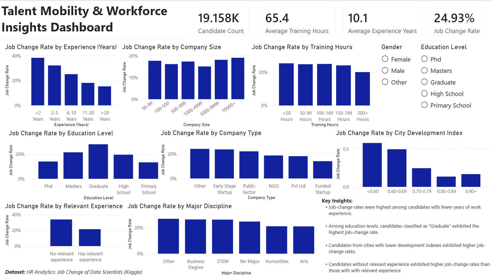

# Talent_Mobility_&_Workforce_Insights_Dashboard
Overview: This Power BI dashboard analyzes factors associated with candidate job-change intent using an HR analytics dataset of approximately 19,000 candidates.

Preview:

Tools Used:  
-Power BI  
-Power Query  
-DAX  
-Excel

Metrics:  
-Candidate Count  
-Job Change Rate  
-Average Experience  
-Average Training Hours

Skills Demonstrated:  
-Data cleaning  
-DAX calculated columns  
-Custom binning/grouping  
-KPI cards 
-Interactive slicers  
-HR analytics  
-Dashboard design  
-Business insight generation

Key Findings:  
-Job-change rates were highest among candidates with fewer years of work experience.  
-Among education levels, candidates classified as "Graduate" exhibited the highest job-change rate.  
-Candidates from cities with lower development indexes exhibited higher job-change rates.  
-Candidates without relevant experience exhibited higher job-change rates than those with with relevant experience

